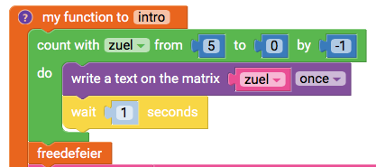
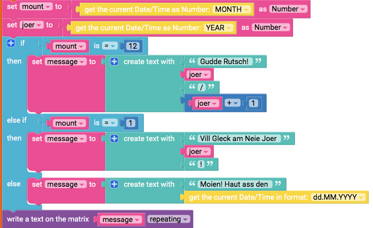
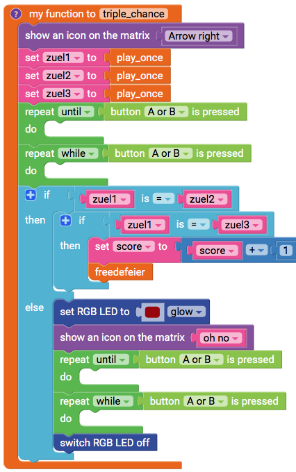
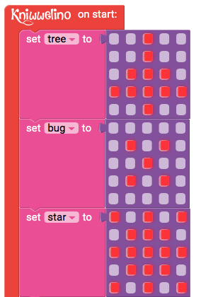
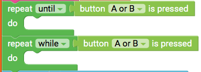
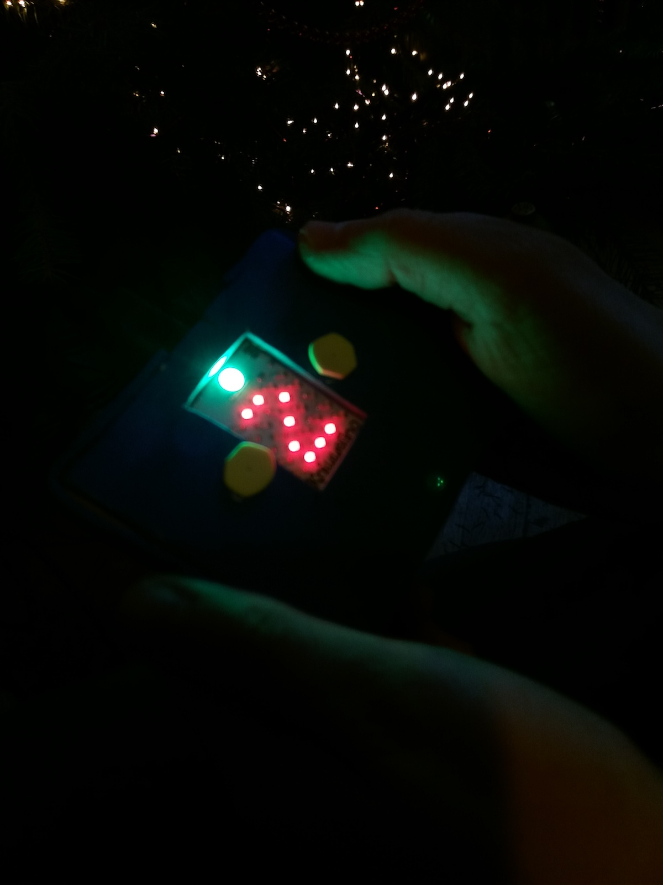
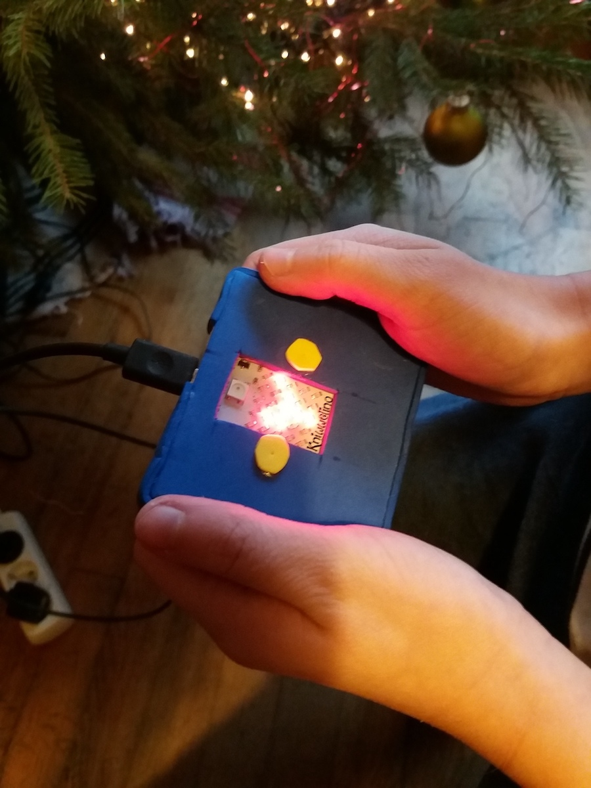
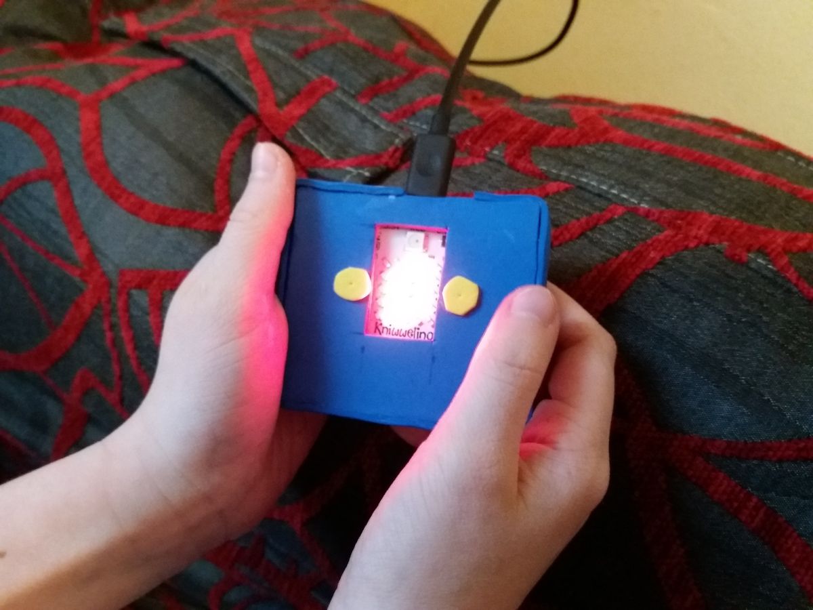

# tripelino
demo + game (triple chance) for "Kniwwelino" (Luxembourgish micro-controller development platform, see https://www.kniwwelino.lu/)

This program has been made for Kniwwelino using exclusively the visual programming tool accessible here: https://code.kniwwelino.lu.
Only one Kniwwelino without any extentions is required.
This program has been designed end of December 2018 and therefore the theme is New Year's Eve.

## Intro
A countdown is shown going from 5 to 0 followed by a small animation of a firework.

After pressing a button, a text is displayed which depends on the current month:
 - December: "Gudde Rutsch! <*current year*>/<*current year+1*>"
 - January: "Vill Gleck am Neie Joer <*current year*>!"
 - other: "Moien! Haut ass den <*current date*>"

## Game: Triple chance
It is a simplified version of the game "triple chance".

While button B is pressed, 3 Symbols (tree, star, glass) are displayed one after the other very quickly (in order to simulate the turning wheel on a casino machine). As soon as the button is released, the wheel stops at the last symbol shown. This function is repeated 3 times.

You win a round if you have 3 times the same symbol. In this case a firework animation is shown.
After 10 rounds, the score is displayed and you can start again :)

In theory, you have a chance of 1/9 to win a round (1/3 * 1/3 * 1/3).

## Issues
I had one issue with a symbol not being displayed: I discovered it was a problem with the second variable being set. As a work-around, I created one not used variable called bug :).

I also discovered the function "button was clicked" did not work as expected for me. I therefore replaced all these functions by a combination of repeat until button x is pressed + repeat while button x is pressed.

## In action

